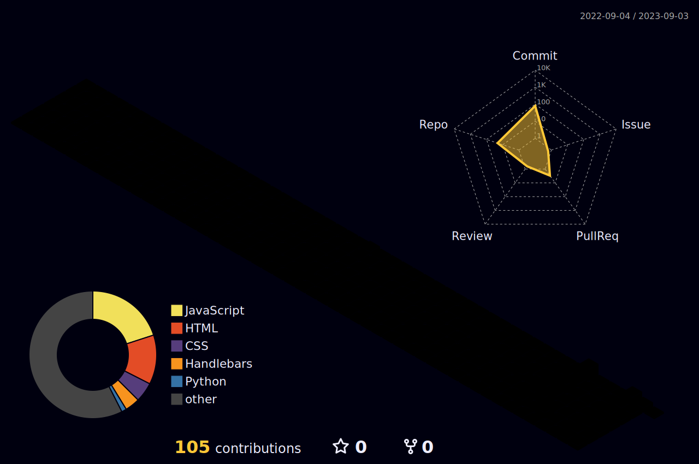

<body>
  

    <h1 style="color: #F7CC18FF;">Hi there, I'm Ahtesham Ahsan👋</h1>
  

  

    
  

 

  <h3>I'm a Mern Stack Developer, Teacher and Researcher!</h3>
  <ul>
    <li>🔭 I’m currently working as a Backend Engineer.</li>
    <li>🌱 I’m currently expanding my knowledge in Python and Machine Learning.</li>
    <li>👯 I’m looking to collaborate with other content creators and developers.</li>
    <li>📢 Love to teach and inspire students. Taught over more than 1000+ students.</li>
    <li>🥅 2023-24 Goals: Contribute more to Open Source projects and Execute my Innovative ideas.</li>
    <li>💎 If you are a Tech boy/girl let's get connected</li>
  </ul>
	

  

	
<h2>Tech Stack</h2>

<table>
<tr>
<td align='center'>

</td>
<td align='center'>

</td>
<td align='center'>

</td>
<td align='center'>

</td>
<td align='center'>

</td>
</tr>
<tr>
<td align='center'>

</td>
<td align='center'>

</td>
<td align='center'>

</td>
<td align='center' width="200">

</td>
<td align='center' width="200">

</td>
</tr>
<tr>
<td align='center' width="200">

</td>
<td align='center' width="200">

</td>
<td align='center'>

</td>
<td align='center' width="200">

</td>
<td align='center' width="200">

</td>
</tr>
<tr>	
<td align='center' width="200">

</td>
<td align='center' width="200">

</td>
<td align='center' width="200">

</td>
<td align='center' width="200">

</td>
<td align='center' width="200">

</td>
</tr>
<tr>
<td align='center' width="200">

</td>
<td align='center' width="200">

</td>
<td align='center' width="200">

</td>
<td align='center' width="200">

</td>
<td align='center'>

</td>
</tr>
</table>

  
  

<table>
  <tr>
    <th>Stats</th>
    <th>Streak</th>
    <th>Languages</th>
  </tr>
  <tr>
    <td></td>
    <td></td>
    <td></td>
  </tr>
</table>
	

	

## ⚡️Github Contributions

<h4 align="center">Isometric view of contributions in the last year</h4>

  

    

 

 
  Views 
  

<h2 align>Spotify Playing 🎧</h2>
    

		

